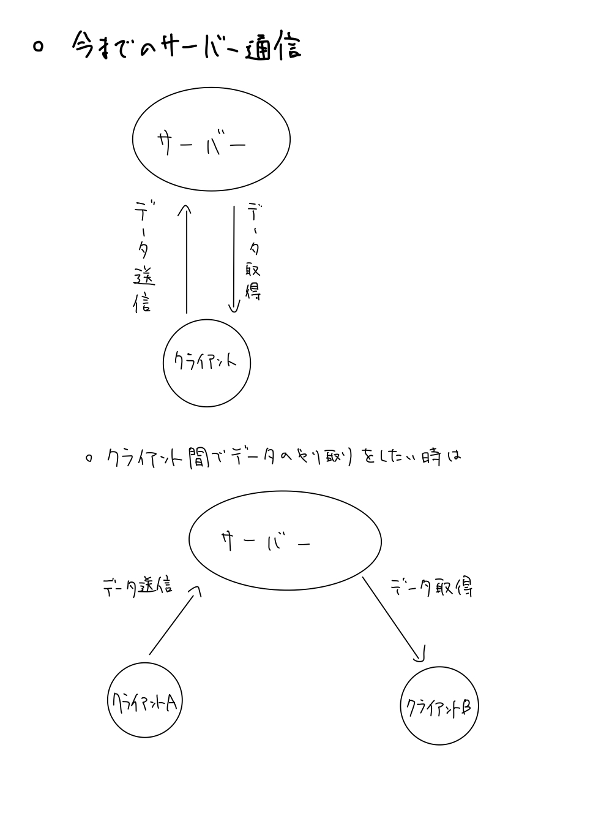
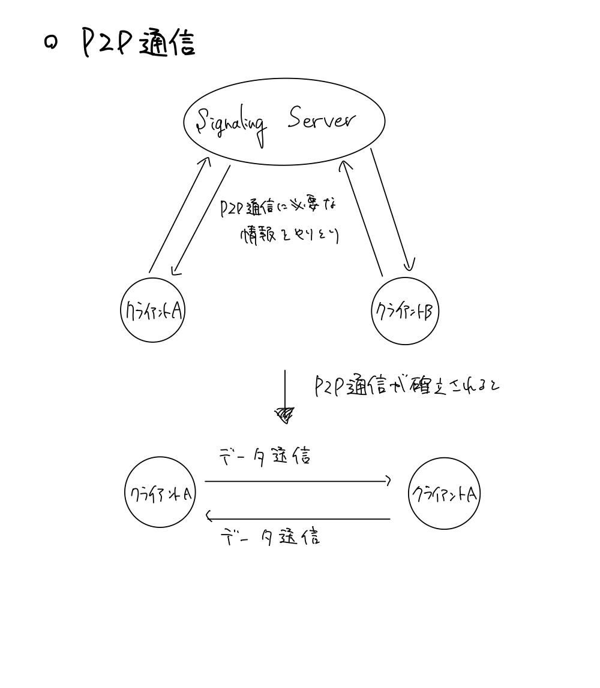

## 1.WebRTCとは

　WebRTCとは、Web Real-Time Communicationの略で、APIを経由してウェブブラウザやモバイルアプリでリアルタイム通信を行う技術のことである。WebRTCでは、Signaling Serverを用いてP2P通信を確立することで、サーバーを介さずに、2クライアント間でのリアルタイム通信を行う。と言っても何が何だかわからないと思うので、順を追って説明する。

### 1-1.P2P通信とは
　P2P通信とは、Peer-to-Peer通信の略である。これは、サーバーを介さずに直接端末間でデータを共有する通信技術のことで、様々なメリットが存在する。例えば

* 通信速度の速さ（サーバーを介さないので）
* 秘匿性の確保（サーバーに存在する情報が少なくなるので）
* サーバー費用の削減

というメリットがある。詳しくは各自で調べてみて欲しい。同様にデメリットも多々存在する。こちらも各自で調べてみて欲しい。

### 1-2.SignalingServerとは

　Signaling Serverとは、Signalingという単語にもあるように、相手に情報を送るサーバーである。P2P通信を確立するためには、相手端末の情報を入手する必要がある。その情報をやり取りするためのサーバーがSignaling Serverである。主にP2P通信の確立と切断の際のみ用いられる。

### 1-3.イメージ図

### 1-4.P2P通信確立までの流れ
　P2P通信確立までには、基本的に以下の4ステップを踏む。以下では、P2P通信を行いたいクライアントをAとBとし、順不同とする。

1. AとBをマッチングさせる
2. AからBへSignaling Serverを介してリクエストと自分の情報を送る
3. BからAへSignaling Serverを介して返答と自分の情報を送る
4. AとBの間に送られてきた情報を元にP2P通信を確立する

ただし、場合によってはステップ2と3は複数回行われる（むしろ複数回行われることがほとんど）。ここものちに解説する。
