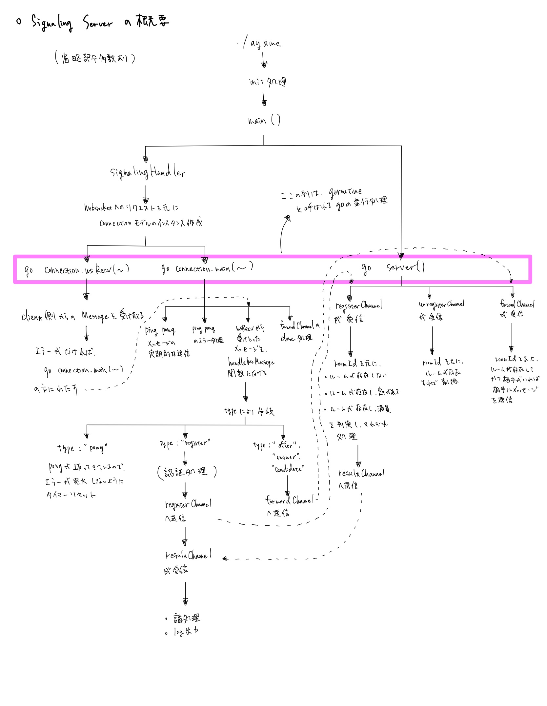

## 3. Ayameの仕様

　ここでは、Ayameの細かい仕様について解説する。概要を掴みたい人は、3-3のみを見て欲しい。Ayameには、Golangで実装されるSignaling Server部分と、JavaScript（node.js）で実装されるClient部分がある。

### 3-1.connectionモデル
　Ayameは基本的にconnectionという通信を管理するモデルを軸に設計されている。これは、詳細な中身は全然違うが、Signaling Server側にもClient側にも定義されている。

#### SignalingServerのconnectionモデル
　Signaling Serverのconnectionモデルは、connection.goに記述されている。fieldとしては

* ID（インスタンス自身の）
* roomID
* clientId
* forwardChannel
* その他認証処理等に使うもの

がある。forwardChannelには別のクライアントのconnectionインスタンスを入れるfieldと、メッセージを入れるfieldがあり、別クライアントにメッセージを送信したい時に使うfieldとなっている。connectionのメソッドで処理の半分以上を実行しているため、全て説明するとキリがないので割愛する。


#### clientのconnectionモデル
　client側のconnectionモデルは、ayame.jsに記述されている。ayame.jsはAyame Web SDK sampleには含まれていない。以下のURLに記載してある。   
Ayame.js : [https://github.com/OpenAyame/ayame-web-sdk/blob/develop/dist/ayame.js](https://github.com/OpenAyame/ayame-web-sdk/blob/develop/dist/ayame.js)  
fieldとしては

* roomID
* signalingUrl
* options
* stream
* remoteStream
* _pc
* _pcConfig
* _isOffer
* _isExistUser
* _callbacks
* その他いろいろ

がある。optionsは、audio/videoの設定、iceServersの初期値、clientId等を管理している。stream/remoteStreamは自分/相手の動画を管理している。_pcはRTCPeerConnectionのインスタンスを管理し、_pcConfigはその設定を管理している。_isOfferや_isExistUserは自分が後から接続したクライアントかどうかを判別するのに用いられる。_callbacksは、重要なので別で説明する。

##### _callbacks
　htmlファイルにベタ書きされている部分に、以下のような記述がある。これは変数connに対し、特定のイベントが行われた際に何かしらの処理を行うように指示している。

```JavaScript
conn.on('disconnect', (e) => {
            console.log(e);
            localVideo.srcObject = null;
});
```
今回でいえば、'disconnect'、つまり通信が切断された際に、原因をconsoleに出力し、localVideoを空にしている。このような、イベントを管理しているのが_callbacksだ。Ayameでは'open'、'connect'、'addstream'、'removestream'と言った物が用意されている。


### 3-2.Signaling ServerとClient側でのメッセージのやりとり
　この2間の通信は、Clientより、Signaling ServerにJSONの形で（実際はbyte列）リクエストとメッセージがPOSTされ、その後にSignaling Serverより、ClientにJSONの形で（実際はbyte列）リクエストとメッセージがPOSTで返される、というやりとりが基本である。なお、この通信はすべてWebSocketで行われている。


### 3-3.Signaling Server概要
　Signaling Serverでの処理の概要は以下の図の通りである。



goroutineというgolang特有の並行処理メソッドが活用されている。goroutineの理解には、以下の記事がわかりやすいかもしれない。  
URL : [https://qiita.com/taigamikami/items/fc798cdd6a4eaf9a7d5e](https://qiita.com/taigamikami/items/fc798cdd6a4eaf9a7d5e)
