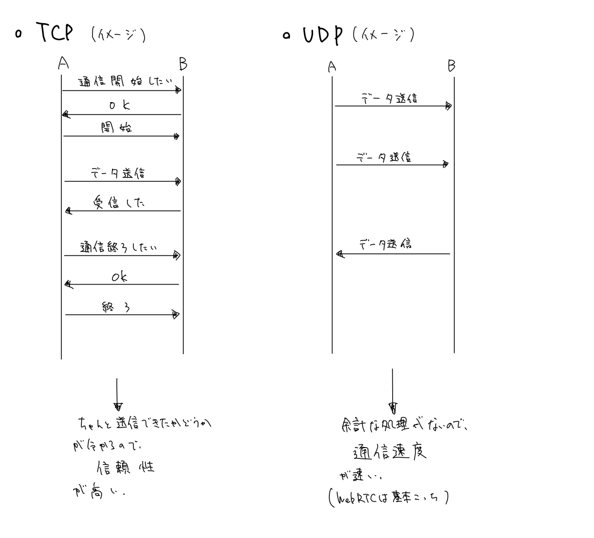
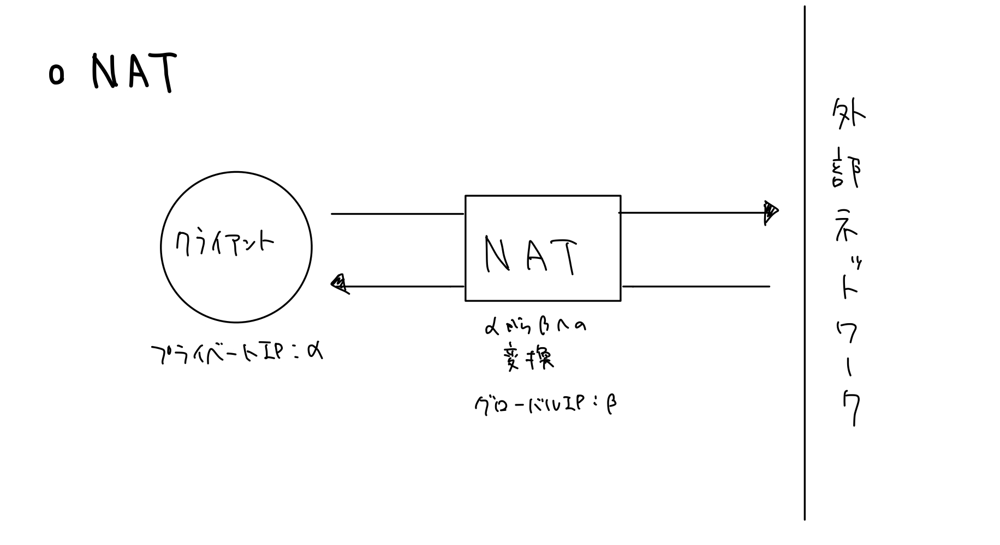
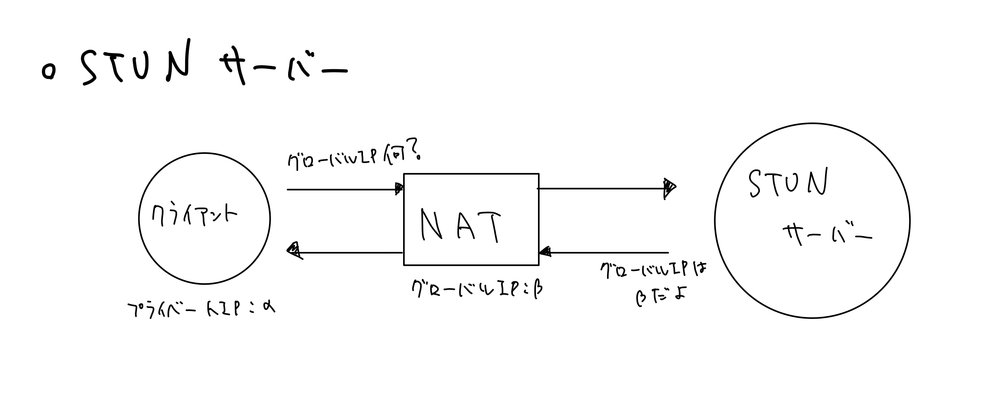
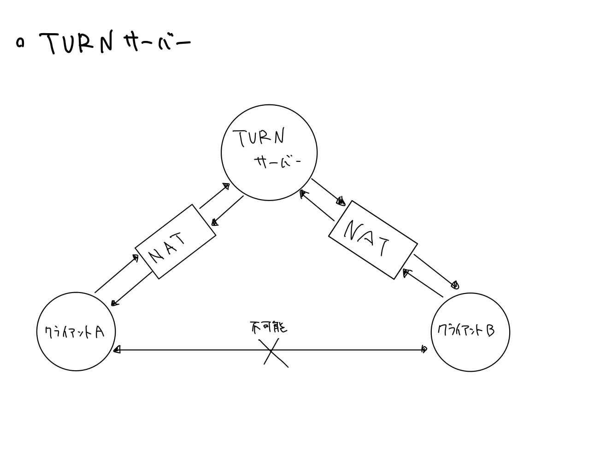
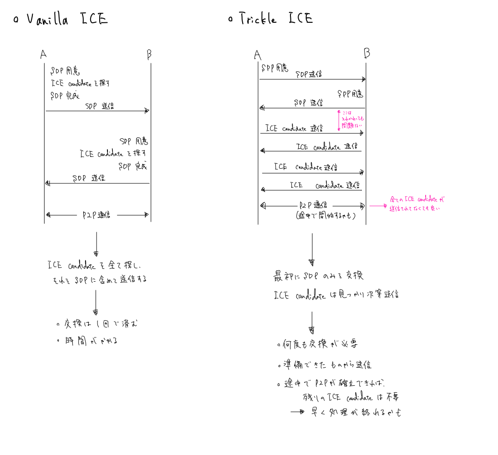

## 5.クライアント間でSignaling Serverを介してやりとりするデータとは
　roomを用いたマッチングが完了したら、次にクライアント間でP2P通信に必要なデータをやり取りする。主に必要なのは、SDPとICEだ。それぞれ解説していく。

### 5-1.SDPとは
　SDPとはSession Description Protocolの略だ。簡単にいうと、P2P通信の内部情報である。具体的には、

* 送られるメディアの種類
* 送られるメディアの形式
* 使用される転送プロトコル
* エンドポイントの IP アドレスとポート
* その他メディア転送エンドポイントを記述するのに必要な情報

が含まれているらしい（[参照](https://developer.mozilla.org/ja/docs/Web/API/WebRTC_API/Connectivity)）。使用される転送プロトコルの項目については一応説明を書いておく。そこまで大切でないので、飛ばしてもらっても構わない。

 使用される転送プロトコルについて 

 
　転送プロトコルには、TCPとUDPが存在する。TCPはTransmission Control Protocolの略で、UDPはUser Datagram Protocolの略である。主な性質的な違いは通信速度と信頼性である。  

 
 

詳しい説明は[https://hldc.co.jp/blog/2019/07/11/2819/](https://hldc.co.jp/blog/2019/07/11/2819/)がわかりやすい。

### 5-2.ICEとは
　ICEとはInteractive Connectivity Establishmentの略である。簡単にいうと、相手端末に到達しうる通信経路の情報である。なぜこのようなものが必要なのか？それにはNATやSTUNサーバー、TRUNサーバーを理解する必要がある。

#### NATとは
　NATとはNetwork Address Translationの略である。名前の通り、IPアドレスの変換技術であり、一般的にはLANに接続された端末からインターネットに接続する時に、プライベートIPをグローバルIPに変換するために使用されている。

   

　また、通信を行うポート番号も同時に変換することで、1つのグローバルIPアドレスでLAN内の複数のIPアドレスを同時に通信できるようにする技術を、NAPT（Network Address and Port Translation）といい、こちらが主流として用いられている。    
　詳しい説明は[https://www.infraexpert.com/study/ip10.html](https://www.infraexpert.com/study/ip10.html)がわかりやすい。

#### STUNサーバーとは
　STUNとはSession Traversal of UDP through NATsの略である。NATという仕組みが存在するため、クライアントからは自分のグローバルIPが分からないことがある。その際に、クライアントのNATの種類や、NATにより割り当てられたグローバルIPなどを教えてくれるサーバーが、STUNサーバーである。

#### TURNサーバーとは
　TURNとはTraversal Using Relay around NATの略である。NATが利用されている際に、直接的にクライアント同士でP2P通信が不可能な場合がある（Firewall等の理由により）。その際に、データの仲介をしてくれるサーバーが、TURNサーバーである。

　つまり、NATやFirewall等により、素直に通信ができない場合があるのだ。ICEは主に、ローカルの候補、STUNサーバーを用いて入手した候補、TURNサーバーを用いて入手した候補の3種類から構成されている。一般的には全種類用意して相手に送信し、うまくいくものを採択することとなる。
### 5-3.一連の流れ
　流れとしては、

1. クライアントAが、offer SDPを送信する
2. クライアントBが、offer SDPを元にanswer SDPを送信する
3. クライアントAが、自身に接続できそうなICE candidateを探して、送信する
4. クライアントBが、自身に接続できそうなICE candidateを探して、送信する
5. 通信を確立できるICE candidateがあれば、P2P通信を開始する

という感じである。ただし、3と4は複数回行われることも多々ある（ここでハマった）。また、2と3は入れ替わったり、3の途中に2が行われたりすることもある。これは、Trickle ICEという方式を採用しているからである。一般的に、ICE candidateの交換方式にはVanilla ICEとTrickle ICEがある。

つまりTrickle ICEは非同期的な処理なので、順番が前後することがある。
