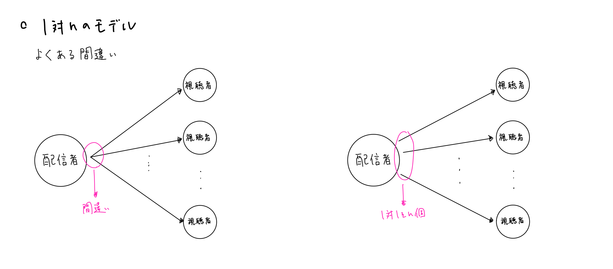

## 8.1対nに拡張する
　先ほどまでの通信は1対1であった。ここからは、1対nに拡張していく。今回は、動画配信サービスという形で拡張していく。1人が動画を配信し、複数人がそれを視聴できるというものだ。

### 8-1.Signaling Serverを書き換える
  　Signaling Serverの書き換えは、実はそこまで難しくない。なぜならそれは1対nの構造にある。1対nとあるが、実は実態は、1対1をn個用意しているだけだ。P2Pはあくまで1対1の通信であるので、n人と接続することは不可能なのだ（ここでめちゃめちゃハマった）。

  

よってサーバー側で必要な変更は、マッチング処理を拡張するだけだ。現状は、roomIDに対し2人までとしている。そこを少し拡張して、2人のペアをいくつも保存できるようにしてあげれば良い。  
　なお、後々の利便性を考えてstreamerとviewerで処理を分けておいた方が良いかもしれないので、一応go connection.main()内のtypeでの分岐をいじり、type:"onair"とtype:"watch"を用意した。


### 8-2.配信者用ページと視聴者用ページを作成する
　次に配信者用のページと視聴者用のページを作成する。配信者は動画を送信するだけでよく、視聴者は動画を受信するだけで良い。つまり、Ayameに元から用意されているsendonly.htmlを配信用のページに、recvonly.htmlを送信用のページに利用すればすぐ済む。


### 8-3.Ayame.jsを書き換える
　そうしたら次に、Ayame.jsを書き換える。Ayame.jsとはクライアント側の処理の大半を記述している部分である。実はこれはgit cloneしてきた、Ayame Web SDK sampleには含まれていない。sample版なので、簡易的なものであり複雑な処理部分は省いているのだ。よって、まずはAyame.jsをコピーする。Ayame.jsは以下のURLに記載してある。   
Ayame.js : [https://github.com/OpenAyame/ayame-web-sdk/blob/develop/dist/ayame.js](https://github.com/OpenAyame/ayame-web-sdk/blob/develop/dist/ayame.js)   
そうしたら、参照先をWeb上のAyame.jsからローカルのAyame.jsに変更する。Ayame.jsの読み込みは、
```HTML
<script src="https://cdn.jsdelivr.net/npm/@open-ayame/ayame-web-sdk@2020.3.0/dist/ayame.js"></script>
```
という部分で行なっているので、ここを先ほどAyame.jsをコピーしたファイルへのパスへと変更する。こうすることで、ローカルのAyame.jsを参照してくれるようになる。  
　次に実際にAyame.jsの中身を書き換えていく。まず、200行目付近の_signaling関数だが、この

```JavaScript
const registerMessage = {
                        type: 'register',
                        roomId: this.roomId,
                        clientId: this.options.clientId,
                        authnMetadata: undefined,
                        key: undefined
                    };
```
という部分が、最初にSignaling Serverに送るメッセージであったので、配信者側はtypeを"onair"に、視聴者側はtypeを"watch"に変更した。onairかwatchかの判別は、関数を呼び出す際に新たに変数を渡して行なった。


### 8-4.htmlに記述されているJSを書き換える
　最後に、HTMLファイルにベタ書きされているJSを書き換える。先ほど、sendonly.htmlをコピーして配信者用の画面を作成したが、そちらのみを書き換えていく。1対1の時は、connという変数名で、Connectionというモデル（Ayame.js内に定義されている）のインスタンスを作成し、それを用いてP2P通信を実現していた。

```JavaScript
conn = Ayame.connection(signalingUrl, roomId, options, true);
```

8-1でも説明したように、1対nに拡張するならば、このインスタンスをそれぞれのクライアントごとにn個作成する必要がある。視聴者の数は動的に変化するので、動的にインスタンスを作成する。今回はJSのobjectに、何人目の視聴者かをkeyにしてインスタンスを保存した。また、動的に作成するために再起関数を用いた。

```JavaScript
let conn;
let connections = {};
let n = 0;
const startConn = async () => {
  options.video.codec = videoCodec;
  const mediaStream = await navigator.mediaDevices.getUserMedia({ audio: true, video: true });
  localVideo.srcObject = mediaStream;
  readyConn(mediaStream);
};

const readyConn = async (mediaStream) => {
  connections[n] = Ayame.connection(signalingUrl, roomId, options, n, true);
  connections[n].on('connect', (e) => {
    n++;
    readyConn(mediaStream);
  })
  connections[n].on('disconnect', (number, e) => {
    delete (connections[number]);
  });
  await connections[n].connectOnAir(mediaStream, null);
}
const disconnect = () => {
  for (i = 0; i < n+1; i++) {
    if (connections[i]) {
      connections[i].disconnect();
      delete(connections[i]);
    }
  }
  localVideo.srcObject = null;
}
```
なお、何人目の視聴者かを保存しておくfieldをconnectionモデルにはやすやめにAyame.jsを拡張してある。


　これで1対nへの拡張は完了である。
